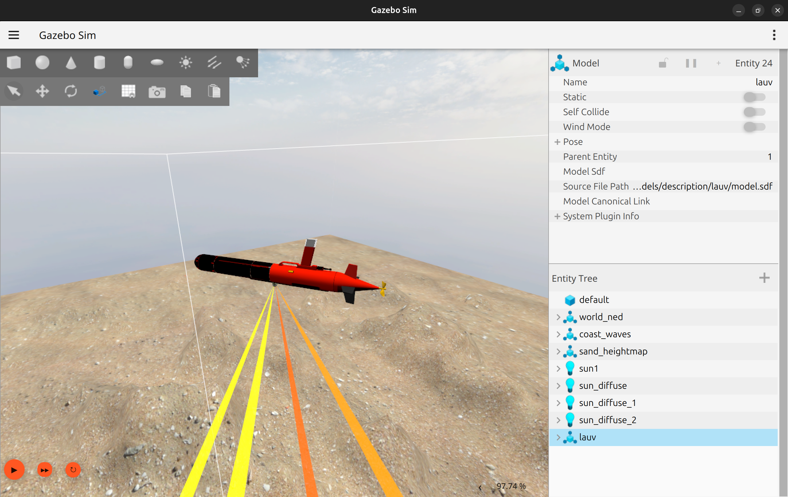

# DAVE

[](https://github.com/IOES-Lab/dave/actions/workflows/docker-amd64.yml)
[](https://github.com/IOES-Lab/dave/actions/workflows/docker-arm64v8.yml)

Documentation is currently at [http://dave-ros2.notion.site](http://dave-ros2.notion.site)

For contribution, do `pip3 install pre-commit && pre-commit install && pre-commit run --all-files` before commit.

---

# Installation (Native)

## Requirements
This only works in Ubuntu 24.04

### ROS2 Jazzy
Follow this installation guide https://docs.ros.org/en/jazzy/Installation/Ubuntu-Install-Debs.html

### Gazebo harmonic
Gazebo installation https://gazebosim.org/docs/latest/install_ubuntu/


### Verify if you have everything alright
Source your ROS env
```
source /opt/ros/jazzy/setup.bash
```
Try to run gazebo
```
gz sim
```

## Download DAVE
Clone this repository to your workspace. Build and source your ws and try running this command
```
ros2 launch dave_demos dave_robot.launch.py z:=-5 namespace:=lauv world_name:=dave_ocean_waves paused:=false

```
The LAUV should pop up like this


